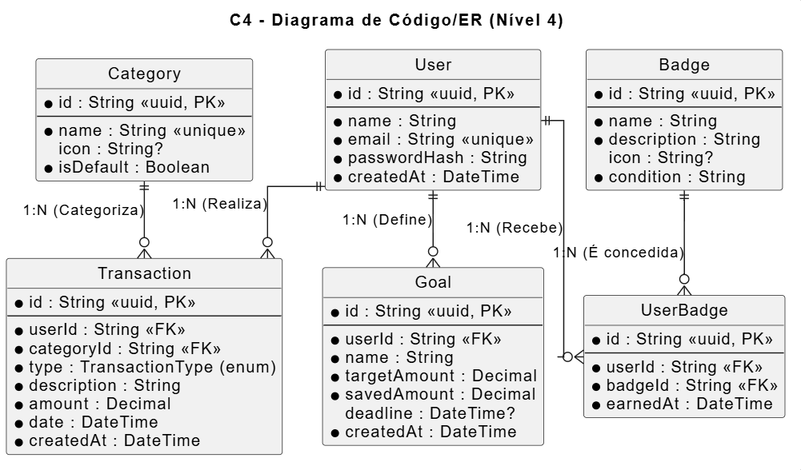

# Diagrama do Banco de Dados

Este documento apresenta a estrutura de entidades, atributos, tipos e relacionamentos do banco de dados do sistema (PostgreSQL). A modelagem principal reflete as tabelas geradas via Prisma ORM.

## Diagrama ER (Entidade-Relacionamento)

*(O código fonte deste diagrama está localizado em `docs/plantuml/c4-4-code-er.puml`)*

---

## Descrição das Entidades Principais

Abaixo um resumo das responsabilidades de cada entidade mapeada no diagrama acima:

- **User**: Armazena os dados de autenticação (com hash de senha bcrypt) e perfil. Atua como o núcleo de posse de dados, ligando-se com transações, metas e medalhas conquistadas em relacionamentos `1:N`.
- **Category**: Categorias utilizadas para classificar as transações financeiras. Possui campos para ícones e a flag `isDefault` para separar as globais do sistema das customizadas pelo usuário.
- **Transaction**: Registra todas as movimentações financeiras. O campo Enum `TransactionType` classifica o registro entre `INCOME` (Receita) ou `EXPENSE` (Despesa). Relaciona-se diretamente via FK com `User` e `Category`.
- **Goal**: Armazena as metas e objetivos financeiros definidos, acompanhando o valor alvo (`targetAmount`) vs o valor economizado no momento (`savedAmount`), além da data limite (`deadline`).
- **Badge**: Medalhas e conquistas disponíveis pela plataforma (ex: "Criou a primeira meta"). Possui um código em `condition` que o back-end avalia.
- **UserBadge**: Entidade associativa que resolve o relacionamento N:M entre Usuários e Medalhas, armazenando quando exatamente o usuário desbloqueou a conquista (`earnedAt`).
